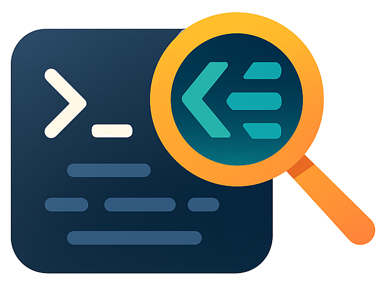

<div align="center">
  
  
  # run-on-output
  *Execute tasks when CLI output patterns are detected*
  
  [](https://github.com/sinedied/run-on-output/actions)
  [](https://www.npmjs.com/package/run-on-output)
  [](https://nodejs.org)
  [](https://github.com/xojs/xo)
  [](LICENSE)

  ⭐ If you like this project, star it on GitHub!

  [Features](#features) • [Installation](#installation) • [Usage](#usage) • [Examples](#examples)

</div>


A lightweight Node.js CLI tool that monitors command output in real-time and triggers actions when specific patterns are found. Perfect for automation workflows, development environments, and CI/CD pipelines.

## Features

- 🎯 **Pattern Matching** - Monitor stdout/stderr for regex patterns or plain strings
- ⚡ **Real-time Monitoring** - Output is forwarded in real-time while monitoring  
- 🔧 **Flexible Actions** - Display messages or execute commands when patterns match
- 📝 **Multiple Patterns** - Wait for multiple patterns before triggering actions
- 🚀 **Zero Dependencies** - Built with Node.js built-in modules only

## Installation

```bash
npm install -g run-on-output
```

Or use without installing:

```bash
npx run-on-output [options] <command> [args...]
```

## Usage

### Basic Examples

**Display a message when server starts:**
```bash
run-on-output -s "Server started" -m "🚀 Server is ready" npm start
```

**Execute a health check when server is listening:**
```bash
run-on-output -p "listening on port \\d+" -r "curl http://localhost:3000/health" node server.js
```

**Monitor development environment startup:**
```bash
run-on-output -s "webpack compiled,server ready" -m "✅ Development environment ready" npm run dev
```

**Multiple actions - show message and open browser:**
```bash
run-on-output -s "ready" -m "Server is up" -r "open http://localhost:3000" npm start
```

**Run npm script when server is ready:**
```bash
run-on-output -s "Server running" -n "test" node server.js
```

> [!TIP]
> You can use the short alias `roo` instead of `run-on-output` for faster typing:
> ```bash
> roo -s "Server started" -m "🚀 Server is ready" npm start
> ```

### Command Line Options

```
run-on-output [OPTIONS] <command> [args...]

OPTIONS:
  -p, --patterns <patterns>    Comma-separated list of regex patterns to watch for
  -s, --strings <strings>      Comma-separated list of plain strings to watch for
  -r, --run <command>          Command to execute after all patterns are found
  -n, --npm <script>           npm script to run after all patterns are found
  -m, --message <text>         Message to display after all patterns are found
  -h, --help                   Show this help message

REQUIREMENTS:
  - Either --patterns or --strings must be specified (but not both)
  - At least one of --run, --npm, or --message must be specified
```

### Pattern Types

**Plain Strings (`-s, --strings`)**
- Matches exact text (case-insensitive)
- Easier to use for simple text matching
- Example: `-s "Server started,Database connected"`

**Regex Patterns (`-p, --patterns`)**
- Use regular expressions for complex matching
- Supports all JavaScript regex features
- Example: `-p "listening on port \\d+,ready in \\d+ms"`

## Examples

**Development Workflow**
```bash
# Wait for both webpack and server, then open browser
run-on-output -s "webpack compiled,Local:" -r "open http://localhost:3000" npm run dev

# Monitor test runner and show completion message
run-on-output -s "Tests completed" -m "✅ All tests passed" npm test
```

**CI/CD Pipeline**
```bash
# Wait for deployment completion and run smoke tests
run-on-output -p "deployment.*complete" -r "./scripts/smoke-test.sh" deploy.sh

# Monitor build process and trigger notifications
run-on-output -s "Build successful" -r "slack-notify '#dev' 'Build completed'" npm run build
```

**Docker & Containers**
```bash
# Wait for container health check and run integration tests
run-on-output -s "healthy" -r "npm run test:integration" docker-compose up

# Monitor database initialization
run-on-output -p "database.*ready" -m "📁 Database initialized" ./start-db.sh
```

**API Development**
```bash
# Wait for API server and run endpoint tests
run-on-output -p "server.*listening.*port" -r "npm run test:api" node api.js

# Monitor microservices startup and run deployment script
run-on-output -s "auth-service ready,user-service ready" -n "deploy" ./start-services.sh

# Combine message, command and npm script
run-on-output -s "Database connected" -m "🎉 Ready for testing" -n "test:integration" npm start
```
